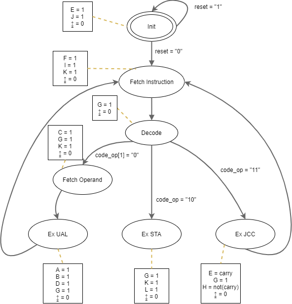

# Conception d'un processeur avec jeu d'instructions élémentaires
Projet dans le cadre du cours EN217 du professeur Christophe JEGO.

## Etude préliminaire
Jeu d'instruction du processeur à réaliser :
| Abréviation | Codage de l'instruction |                     Description de l'instruction                    |
|:-----------:|:-----------------------:|:-------------------------------------------------------------------:|
|     NOR     |        **00** AAAAAA        |                     ACCU = ACCU NOR Mem[AAAAAA]                     |
|     ADD     |        **01** AAAAAA        |    ACCU = ACCU + Mem[AAAAAA], mise à jours de la retenue (Carry)    |
|     STA     |        **10** AAAAAA        |                          Mem[AAAAAA] = ACCU                         |
|     JCC     |        **11** DDDDDD        | Si Carry = 0 **alors** PC = DDDDDD **sinon** effacer la retenue (Carry = 0) |

Diagramme d'état de la machine à état fini :

