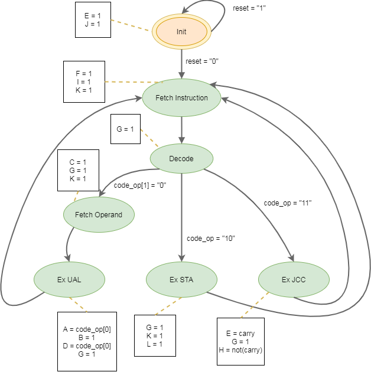

# Conception d'un processeur avec jeu d'instructions élémentaires
Projet dans le cadre du cours EN217 du professeur Christophe JEGO.

## Etude préliminaire
Diagramme d'état de la machine à état fini :

